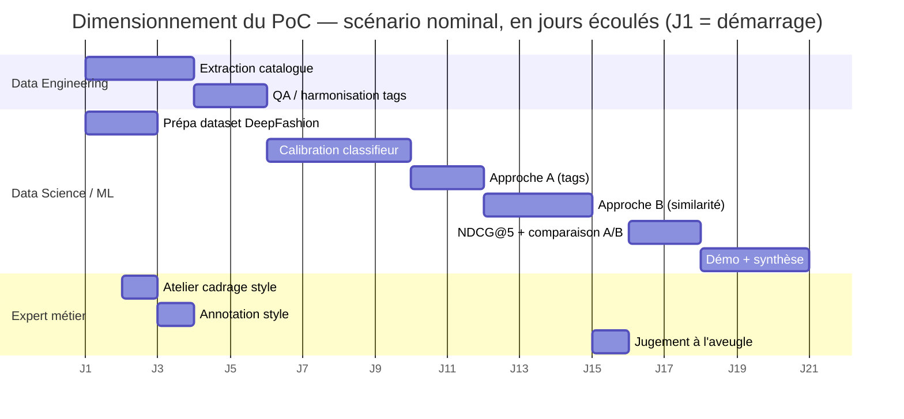

# Dimensionnement du PoC — durée, profils et jours-hommes

## Vue d'ensemble

**~21,5 jours-hommes, répartis sur 4 à 5 semaines calendaires**, mobilisant 3 profils : Data Engineer, Data Scientist / ML Engineer, Expert métier style.

## Résumé par profil

| Profil | Jours-hommes | Rôle dans le PoC |
|---|---|---|
| Data Scientist / ML Engineer | 14,5 | Prépare le dataset, calibre le classifieur d'attributs, implémente et évalue les deux approches, construit la démo |
| Expert métier (style) | 2,5 | Cadre la taxonomie de style, annote les photos, juge les recommandations à l'aveugle |
| Data Engineer | 4,5 | Extrait et fiabilise le catalogue Fashion-Insta |
| **Total** | **21,5** | |

Le besoin en profils n'est donc pas uniquement technique : l'expert métier intervient à trois reprises (cadrage du style, annotation, jugement) pour un effort limité (2,5 jours-hommes) mais réparti sur toute la durée du PoC — c'est sa disponibilité, plus que son temps, qui pèse sur le planning (voir Risques).

## Détail par tâche

| Tâche | Profil | Jours-hommes | Dépend de |
|---|---|---|---|
| Extraction & centralisation catalogue Fashion-Insta (images, tags, prix) | Data Engineer | 3 *(chiffre donné par le document métier d'Alicia)* | — |
| Contrôle qualité / harmonisation des tags catalogue | Data Engineer | 1,5 | Extraction catalogue |
| Préparation dataset DeepFashion (profils synthétiques 10-15, tri qualité) | Data Scientist / ML Engineer | 2 | — |
| Mise en place + calibration du classifieur d'attributs | Data Scientist / ML Engineer | 4 | Catalogue + dataset prêts |
| Implémentation approche A (correspondance par tags) | Data Scientist / ML Engineer | 1,5 | Classifieur |
| Implémentation approche B (similarité vectorielle) | Data Scientist / ML Engineer | 3 | Classifieur + taxonomie de style définie (atelier de cadrage) |
| Atelier de cadrage style (alignement des attributs avec la taxonomie métier) | Expert métier (style) | 0,5 | — |
| Annotation du style dominant sur les photos retenues | Expert métier (style) | 1 | Dataset prêt |
| Session de jugement à l'aveugle (100 à 150 jugements) | Expert métier (style) | 1 | Approches A et B disponibles |
| Calcul NDCG@5, comparaison A/B, analyse par style | Data Scientist / ML Engineer | 1,5 | Jugements experts |
| Démo (notebook / interface légère) + synthèse pour la restitution | Data Scientist / ML Engineer | 2,5 | Analyse finale |

## Diagramme de Gantt (planning indicatif)

L'axe horizontal représente des **jours écoulés (J1, J2, ...)**, pas des dates réelles : le diagramme montre l'enchaînement et le parallélisme des tâches, pas un calendrier. Durées arrondies à la journée entière supérieure pour la lisibilité — le chiffrage exact est dans les tableaux ci-dessus. Ce scénario nominal tient sur ~20 jours ; le reste de la fourchette annoncée (4 à 5 semaines) est la marge de sécurité si les risques ci-dessous se matérialisent.

## Risques sur ce chiffrage

- **Calibration du classifieur d'attributs (le poste le plus incertain).** Le modèle préentraîné sur DeepFashion peut mal généraliser aux photos catalogue Fashion-Insta (éclairage, angles, fond différents des photos DeepFashion). Si la première calibration ne sépare pas correctement les styles, ce poste peut dépasser les 4 jours prévus. Un point de passage à mi-PoC est recommandé pour arbitrer rapidement vers un plan de repli si besoin.
- **Disponibilité de l'expert métier, plus que l'effort lui-même.** 2,5 jours-hommes répartis sur 3 créneaux (atelier, annotation, jugement) peuvent s'étaler bien au-delà de 4-5 semaines si ces créneaux ne sont pas réservés à l'avance dans l'agenda de l'expert.
- **Statut du travail d'extraction catalogue déjà chiffré à 3 jours-hommes.** Ce chiffre correspond à l'effort qu'a nécessité la production des chiffres clés du document métier. Il n'est pas certain qu'il couvre une extraction complète et réutilisable (images en lot, tags exploitables pour le ML), ou s'il faudra un travail supplémentaire pour obtenir un jeu de données prêt pour l'expérimentation. Par prudence, ce PoC le budgète à nouveau plutôt que de le supposer gratuit.
