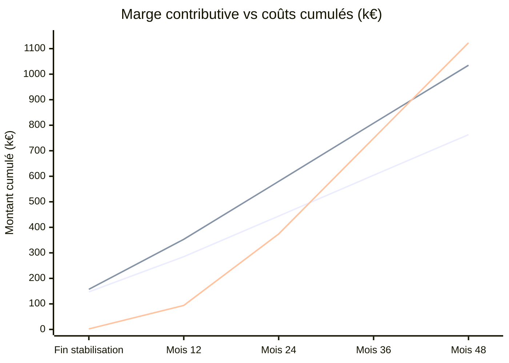

# Projection de couverture des coûts Data & IA — hypothèses explicites

Cette projection compare les gains et les coûts cumulés année après année. Elle est **illustrative**, car le Marketing estime les ventes supplémentaires de l'application entière, alors que [`couts.md`](couts.md) ne chiffre que la Data & IA. La répartition du gain entre Data & IA et les autres leviers (marketing, etc.) n'est pas connue à ce stade ; ce calcul utilise le gain total sans répartition, un ajustement à faire ultérieurement une fois cette clé de répartition disponible.

## Ventes supplémentaires estimées par le Marketing

Source : document métier d'Alicia (`Projet/01-Mission/P9-Expression-de-besoins-metiers.pdf`).

- CA web actuel : 5,2 M€ ; hausse estimée à 24 mois : **14 %**, soit 728 000 €/an à plein régime.
- CA magasin actuel : 5,2 M€ ; hausse estimée à 24 mois : **4 %**, soit 208 000 €/an à plein régime.
- Total : **936 000 €/an de chiffre d'affaires additionnel au mois 24**, pour l'application entière. Ce montant n'est pas un bénéfice.

Pour comparer ces ventes aux coûts, on utilise une **marge contributive incrémentale illustrative de 40 %** : elle doit représenter ce qui reste après coût des produits, remises, retours, livraison, paiement et acquisition. Finance doit fournir le taux réel. Le Marketing donne un objectif au mois 24 mais pas de trajectoire : une rampe linéaire depuis le lancement du Run est donc supposée, puis un niveau stable.

| Période depuis le lancement du Run | CA additionnel sur la période | Marge contributive à 40 % | Marge contributive cumulée |
| --- | ---: | ---: | ---: |
| Mois 1–12 | 234 000 € | 93 600 € | 93 600 € |
| Mois 13–24 | 702 000 € | 280 800 € | 374 400 € |
| Année 3 | 936 000 € | 374 400 € | 748 800 € |
| Année 4 | 936 000 € | 374 400 € | 1 123 200 € |

## Calendrier et formule de cumul

La construction comprend le PoC (4 à 5 semaines), le MVP (9 semaines), puis les **7 premières semaines du Run consacrées à la stabilisation**. On note `t = 0` le lancement du Run et `s = 7 × 12 / 52 ≈ 1,62 mois` la fin de stabilisation. Les coûts PoC + MVP + stabilisation sont inclus une seule fois dans le one-shot. Les coûts récurrents de croisière ne commencent qu'après `s`. Les ventes supplémentaires démarrent à `t = 0` : leur marge pendant la stabilisation n'est donc plus omise.

| Poste de [`couts.md`](couts.md) | Best case | Worst case |
| --- | ---: | ---: |
| One-shot, stabilisation comprise | 146 967 € | 156 816 € |
| Croisière après stabilisation | 159 384 €/an | 227 094 €/an |

Pour `t ≥ s`, le coût cumulé est `one-shot + coût annuel × (t − s) / 12`. Avec 40 % de marge, la marge cumulée est `650 × t²` euros jusqu'au mois 24, puis `374 400 + 31 200 × (t − 24)` euros. Le tableau ci-dessous utilise **le même axe de temps** pour coûts et gains ; ses montants sont arrondis à l'euro.

| Jalon depuis le début du Run | Coût cumulé best | Coût cumulé worst | Marge cumulée | Solde best | Solde worst |
| --- | ---: | ---: | ---: | ---: | ---: |
| Fin stabilisation (~mois 1,62) | 146 967 € | 156 816 € | 1 696 € | -145 271 € | -155 120 € |
| Fin année 1 (mois 12) | 284 895 € | 353 340 € | 93 600 € | -191 295 € | -259 740 € |
| Fin année 2 (mois 24) | 444 279 € | 580 434 € | 374 400 € | -69 879 € | -206 034 € |
| Fin année 3 (mois 36) | 603 663 € | 807 528 € | 748 800 € | +145 137 € | -58 728 € |
| Fin année 4 (mois 48) | 763 047 € | 1 034 622 € | 1 123 200 € | +360 153 € | +88 578 € |

## Date d'équilibre et sensibilité

Dans **ce seul scénario** (marge de 40 %, coûts Azure et trafic supposés), la marge cumulée couvre les coûts vers **27,9 mois après le lancement du Run en best case** et **40,8 mois en worst case**. À 24 mois, il faudrait une marge d'environ **47,5 %** (best) ou **62,0 %** (worst) pour être déjà à l'équilibre.

Les coûts GPU, les volumes d'essayages et la latence doivent être mesurés pendant le pilote ; les montants de [`couts.md`](couts.md) restent des estimations de cadrage.

## Visualisation de la projection illustrative

