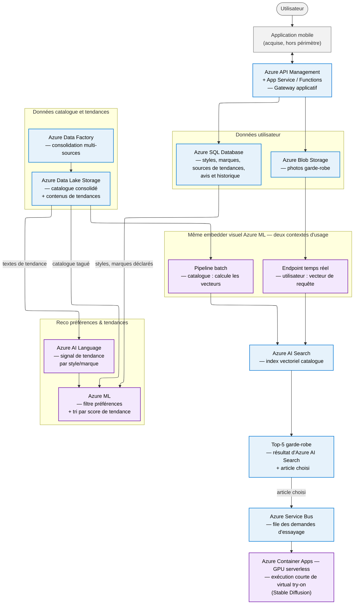

# System Design de la solution en production

## Périmètre du schéma

Seule la partie **Data & IA** est représentée : les briques purement logicielles de l'application mobile (compte utilisateur, écrans, paiement, intégration e-commerce) sont considérées acquises et ne sont pas détaillées ici.

Le schéma part de l'utilisateur final et de la donnée qu'il envoie à l'application, jusqu'à la donnée brute (catalogue, historique), et nomme pour chaque brique le **service Azure** retenu (partenaire cloud de Fashion-Insta). Il couvre l'ensemble des besoins métiers touchant à la donnée ou à l'IA — pas seulement la brique de recommandation garde-robe cadrée par le PoC :

- la recommandation à partir de la garde-robe photographiée, par **recherche vectorielle** — l'approche B (attributs classifiés) de [`probleme-ml.md`](../01-poc/probleme-ml.md) sert de point de départ, à exécuter et valider par le PoC ; la cible production dépend du **jalon de décision post-PoC (attributs classifiés vs embedder appris)** qui en découle, sur un index vectoriel Azure AI Search (voir ci-dessous) ;
- l'affichage du vêtement recommandé sur la photo de l'utilisateur, avec changement de couleur/style ;
- la recommandation à partir des préférences déclarées et des tendances (styles, marques, blogs/influenceurs référencés) ;
- la collecte des avis utilisateur sur la pertinence des recommandations ;
- la gestion des données personnelles associées à ces flux, représentée comme brique transverse car elle contraint le stockage et les pipelines qui consomment ces données.

Le cadrage du PoC retient l'approche B (attributs classifiés → vecteur → recherche vectorielle) comme approche prioritaire — elle reste à exécuter et valider expérimentalement, le PoC n'ayant pas encore eu lieu. Le jalon de décision post-PoC conditionne explicitement la suite : si l'approche B (attributs classifiés) donne des résultats suffisants, elle est conservée telle quelle en production ; sinon, l'encodeur évolue vers un **embedder appris directement sur l'image** (réseau de vision entraîné), capable de capturer des nuances stylistiques au-delà des attributs explicitement classifiés. Dans les deux cas, les vecteurs des articles du catalogue sont persistés et interrogés dans un **index vectoriel Azure AI Search** : il s'agit donc d'une vraie recherche de voisins les plus proches, et non d'un scan exhaustif du catalogue.

## Architecture cible — flux principaux et services Azure

Bleu = stockage/plateforme Azure. Violet = brique ML/IA. Gris = utilisateur et systèmes externes. Les traits représentent les flux de données ou d'exécution principaux.

Le **même modèle d'embedder, dans une même version validée**, est exécuté dans deux contextes distincts : un pipeline batch calcule les vecteurs des articles lorsque le catalogue évolue et alimente l'index Azure AI Search ; l'endpoint temps réel ne calcule que le vecteur de la photo utilisateur, utilisé comme requête sur cet index déjà constitué. L'index catalogue n'est donc jamais recalculé lors d'une requête utilisateur.

Les deux recommandations sont **indépendantes** : la recommandation garde-robe repose sur la similarité visuelle et peut déclencher le virtual try-on après le choix d'un article ; la recommandation préférences/tendances s'appuie sur les styles, marques et sources de tendances référencées par l'utilisateur. Elle ne passe ni par l'embedder visuel ni par le virtual try-on, et se décompose en deux temps : Azure AI Language extrait en batch un score de tendance par style/marque à partir des textes déjà consolidés dans le lac de données, puis Azure ML le combine en temps réel aux préférences déclarées et au catalogue disponible.

Le MLOps et le RGPD sont des capacités transverses détaillées dans le tableau ci-dessous ; ils ne sont pas représentés afin de préserver la lecture du flux principal.

## Briques et justification des choix Azure

| Brique | Service Azure | Rôle | Justification |
|---|---|---|---|
| Gateway applicatif | Azure API Management + App Service / Functions | Point d'entrée unique : upload photo, requêtes de reco, préférences, avis ; renvoie la réponse à l'app. | Service managé standard pour exposer et sécuriser des API REST, sans gestion d'infrastructure. |
| Stockage photos | **Azure Blob Storage** | Photos de garde-robe (collection multi-photos gérée dans le temps) et rendus générés par le virtual try-on (cache des essais). | Fait pour du stockage objet volumineux et peu structuré (images) ; tiering (chaud/froid) utile vu la fréquence d'accès variable. Les rendus générés sont eux aussi de la donnée personnelle (photo de l'utilisateur) : mêmes règles de rétention/purge que les photos source, sans brique supplémentaire. |
| Stockage structuré | **Azure SQL Database** | Styles et marques préférés, références de blogs/sites/influenceurs, avis, historique de recommandations et feedback utilisateur. | Toutes ces données ont un schéma stable et bien défini (user_id, item_id, type de préférence, URL référencée, note, timestamp...) : c'est de la donnée structurée, donc SQL — pas besoin de NoSQL ni de traitement en flux à ce stade de volumétrie. Plus simple à gouverner et interroger pour la purge RGPD qu'une base NoSQL. |
| Ingestion des sources | Azure Data Factory | Ingestion batch du PIM/ERP/e-commerce (catalogue, prix, disponibilité), des événements de conversion et des contenus de tendance dont l'usage est autorisé. | Orchestrateur ETL managé, adapté à des sources hétérogènes ; les clics, paniers et achats permettent de mesurer la valeur business et d'améliorer la recommandation. |
| Stockage du lac de données | Azure Data Lake Storage | Conservation zonée des données brutes, du catalogue consolidé, des textes de tendances et des jeux d'entraînement. | Stockage à bas coût, source versionnée pour l'entraînement et l'indexation ; sépare les données brutes des tables transactionnelles de l'application. |
| Entraînement et indexation | Azure Machine Learning pipelines | Jalon de décision post-PoC : conserve le classifieur d'attributs (approche B) si ses résultats suffisent, ou entraîne l'embedder appris si le PoC le justifie ; calcule ensuite, en batch, les embeddings/vecteurs des articles avant chaque publication d'index. | Sépare le calcul coûteux et rejouable de l'inférence en ligne ; la version du modèle et celle de l'index restent traçables. |
| Index vectoriel | **Azure AI Search** | Stocke les vecteurs catalogue et leurs métadonnées (référence, prix, disponibilité, catégorie) ; exécute la recherche de voisins les plus proches, avec filtres métier. | Service managé de recherche vectorielle, évolutif avec le catalogue et le trafic. Il évite de faire porter la recherche de similarité au service de recommandation et permet une recherche hybride ultérieure. |
| Embedding et profil utilisateur | Azure ML managed online endpoint | Contrôle la qualité de l'image, produit l'embedding de chaque photo et agrège les embeddings de garde-robe en un vecteur de profil. | Endpoint temps réel managé avec autoscaling ; Azure ML prend en charge le déploiement, le serving, la sécurisation et le monitoring du modèle. |
| Reco garde-robe | Azure AI Search | Reçoit le vecteur de requête produit par l'endpoint, applique les filtres métier (disponibilité, prix, catégories) et renvoie le Top-5 du catalogue. | La recherche de voisins proches est déléguée au moteur vectoriel spécialisé ; l'index catalogue est déjà calculé au moment de la requête. |
| Signal de tendance | Azure AI Language | Analyse le texte disponible des sources de tendance consolidées dans le lac de données (articles, légendes, hashtags des blogs/comptes référencés) et produit un score de tendance par style et par marque. **Limite assumée** : ne traite pas le contenu purement visuel (photos sans texte associé) ; à réévaluer si le signal texte s'avère insuffisant. | Traitement batch, à la même fréquence que le catalogue : le contenu de ces sources évolue lentement, pas besoin de le recalculer à chaque requête utilisateur. |
| Reco préférences & tendances | Azure ML | Combine les styles/marques déclarés par l'utilisateur, le score de tendance et le catalogue disponible pour produire le Top-N. | Calcul léger côté endpoint temps réel ; ce moteur est indépendant de la recommandation par similarité visuelle (n'utilise ni l'embedder ni Azure AI Search). |
| Virtual try-on génératif | Azure Service Bus + Azure Container Apps (GPU serverless) + Azure Container Registry Premium | Une demande est placée dans une file ; une exécution courte déclenchée par événement lance le conteneur du modèle, produit le rendu, l'enregistre dans Blob et met à jour son statut dans SQL. | Le traitement asynchrone lisse les pics. Le scénario de coût suppose que l'exécution s'arrête après le rendu ; le registre Premium permet d'étudier l'artifact streaming pour réduire le démarrage à froid. La compatibilité pratique du job GPU, la latence p95 et les secondes facturées doivent être validées au MVP. Le cache évite de régénérer un essai identique. |
| Gestion RGPD | Azure Functions | Exécute les politiques de conservation, l'export et la suppression à la demande sur Blob et SQL, y compris les rendus et les statuts associés. | Jobs serverless adaptés aux traitements planifiés. La suppression est journalisée ; la politique de rétention et le traitement des sauvegardes sont définis dans le livrable RGPD. |
| Sécurité transverse | Microsoft Entra ID, Managed Identities, Key Vault, Private Endpoints | Authentification, autorisations minimales, secrets, chiffrement et accès réseau privé aux services de données et ML. | Les photos sont des données sensibles : les contrôles de sécurité doivent être intégrés à chaque flux, pas ajoutés après coup. |
| MLOps et observabilité | Azure Machine Learning (pipelines, registre) + Azure Monitor | Versionne les modèles et index, déploie après validation et surveille latence, disponibilité, coût GPU, dérive, taux d'échec, clics, conversion et satisfaction. | Distingue l'observabilité technique de la qualité métier ; les logs de prédiction et le feedback servent à déclencher une revue avant tout réentraînement. |

## Scalabilité et volumétrie

Le dimensionnement s'appuie sur les chiffres du document métier d'Alicia : ~400 000 utilisateurs visés au moins une fois par an, dont plusieurs dizaines de milliers d'utilisateurs actifs, pour un catalogue d'environ 875 références.

- Azure Data Factory / Data Lake Storage, l'entraînement et le calcul des embeddings catalogue sont des traitements **batch** : une nouvelle version de l'index vectoriel est publiée après validation, sans bloquer l'index en production.
- La recommandation garde-robe est un chemin **temps réel** : l'endpoint produit le vecteur de profil, puis Azure AI Search exécute une recherche de voisins les plus proches dans l'index vectoriel, avec autoscaling des services.
- La recommandation préférences & tendances suit le même principe : le signal de tendance (Azure AI Language) est recalculé en **batch**, à la fréquence du catalogue ; seule la fusion avec les préférences déclarées reste un calcul **temps réel**, léger, côté endpoint Azure ML.
- Le virtual try-on génératif est le plus coûteux en calcul par requête : Azure Service Bus met la demande en file ; une exécution courte Azure Container Apps sur GPU serverless traite le rendu. L'application consulte le statut puis récupère le résultat. Le T4 est disponible en France Central. Le scénario A100 de coût élevé nécessite une autre région, par exemple Italy North : le transfert d'images et les règles de localisation devront être validés avec le DPO. Le pilote doit confirmer que le démarrage et le rendu restent assez rapides ; si un worker doit rester actif entre les demandes, son coût de disponibilité remplacera le coût par exécution retenu dans le chiffrage.
- À mesure que le trafic augmente, les métriques de latence, coût par essai, conversion et saturation de file déterminent respectivement l'autoscaling, le budget GPU et les seuils de capacité.

## Hors périmètre de ce schéma

Comptes utilisateurs, écrans de l'application mobile, tunnel d'achat et intégration e-commerce : briques purement logicielles considérées acquises, non chiffrées dans ce cadrage.
