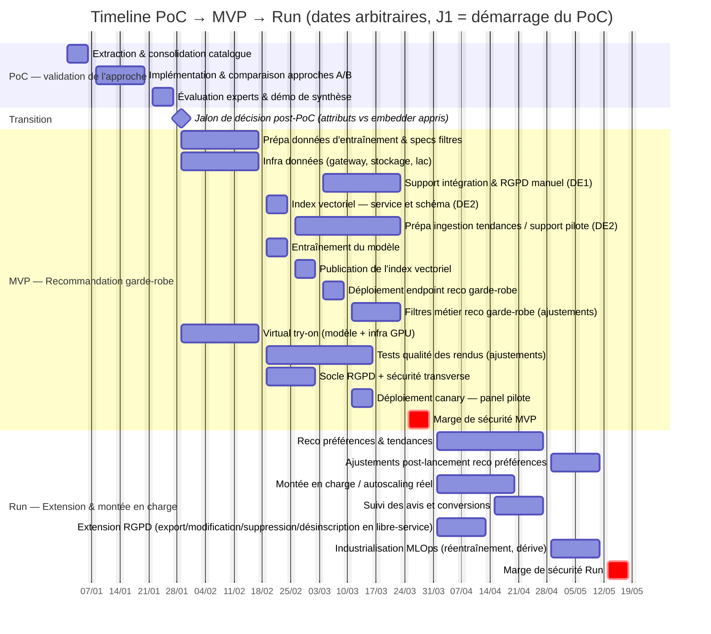

# Timeline de livraison — solution en production

## Vue d'ensemble

Trois phases distinctes, en succession logique : le PoC valide la faisabilité technique du cœur ML, le MVP met en production la brique validée pour un panel restreint, le Run étend le périmètre fonctionnel et monte en charge vers la cible complète.

| Phase | Durée | Objectif |
|---|---|---|
| PoC | ~4 à 5 semaines ([`dimensionnement.md`](../01-poc/dimensionnement.md)) | Valider expérimentalement l'approche de recommandation garde-robe (approche B) avant tout engagement de production. |
| MVP | ~9 semaines ouvrées | Mettre en production la recommandation garde-robe et le virtual try-on, sur un panel pilote restreint, avec le socle RGPD minimal. |
| Run | ~7 semaines de stabilisation, puis rythme de croisière continu | Livrer la recommandation préférences & tendances, monter en charge vers la cible (~400k utilisateurs/an), industrialiser le MLOps et compléter le traitement des données personnelles. |

Les briques techniques et leurs responsables sont décrits dans [`system-design.md`](system-design.md) et [`roles-responsabilites.md`](roles-responsabilites.md).

## Détail PoC

**Objectif** : valider expérimentalement l'approche de recommandation garde-robe avant tout engagement de production. Les tâches ci-dessous synthétisent le planning détaillé dans [`dimensionnement.md`](../01-poc/dimensionnement.md).

| Tâche | Profil | Durée | Livrable |
|---|---|---|---|
| Extraction & consolidation du catalogue Fashion-Insta | Data Engineer | ~1 semaine | Catalogue exploitable pour l'entraînement et l'évaluation |
| Implémentation et comparaison des approches A/B | Data Scientist | ~2 semaines | Approche B (similarité vectorielle) comparée à la baseline (tags) |
| Évaluation à l'aveugle par experts métier + démo de synthèse | Data Scientist, Expert métier (style) | ~1 semaine | Rapport de résultats (NDCG@5), démo pour le jalon de décision |

Le **jalon de décision post-PoC (attributs classifiés vs embedder appris)** intervient après l'évaluation métier, à la transition vers le MVP. Le PoC utilise des vecteurs construits à partir d'attributs classifiés ; selon ses résultats, cette approche est conservée ou l'encodeur évolue vers un embedder appris directement sur l'image. Le jalon n'a pas de durée propre : la préparation et la restitution des résultats sont comprises dans le PoC.

## Diagramme de Gantt (planning indicatif)

L'axe montre des **dates calendaires indicatives** (J1 correspond au démarrage du PoC), week-ends exclus du calcul des durées (`excludes weekends`). Le PoC occupe 20 jours ouvrés dans le scénario nominal ; sa fourchette de 4 à 5 semaines conserve une marge pour les risques décrits dans [`dimensionnement.md`](../01-poc/dimensionnement.md). Les repères S1 à S9 du staffing MVP/Run sont comptés depuis la fin du PoC, en blocs de 5 jours ouvrés. Chaque phase de production se termine par une **marge de sécurité** après ses tâches de construction et d'ajustement.

Le **jalon de décision** clôt le PoC et précède le MVP. L'**entraînement du modèle** attend la préparation des données et l'infrastructure. L'ouverture du panel pilote dépend de l'endpoint de reco, du virtual try-on et du socle RGPD/sécurité. Les ajustements des filtres et de la qualité des rendus se poursuivent pendant le pilote et se terminent avant la marge de fin de phase.

## Détail MVP

**Objectif** : livrer la recommandation garde-robe et le virtual try-on en production, sur un panel pilote, avant ouverture complète.

| Tâche | Type | Profil | Durée | Livrable |
|---|---|---|---|---|
| Prépa données d'entraînement & specs filtres | Développement | Data Scientist (DS1) | 3 semaines | Jeu de données d'entraînement prêt, spécification des filtres métier |
| Infra données (gateway, stockage, lac) | Développement nouvelle brique | Data Engineer (DE1, DE2) | 3 semaines | Contrats d'API, stockage et lac de données opérationnels, incluant un mécanisme simple de collecte des avis utilisateur (note + commentaire) dès le pilote |
| Socle RGPD + sécurité transverse | Pérennisation / conformité | Data Engineer (DE1), Tech Lead | 2 semaines | Purge automatique active, revue de sécurité documentée |
| Support intégration & traitement RGPD manuel | Pérennisation / support | Data Engineer (DE1) | 3 semaines | Incidents d'intégration résolus sur l'infra livrée ; demandes d'accès, de modification, de suppression et de désinscription traitées manuellement |
| Index vectoriel — service et schéma | Développement | Data Engineer (DE2) | 1 semaine | Service Azure AI Search configuré et schéma publié |
| Préparation ingestion tendances / support pilote | Pérennisation / anticipation Run | Data Engineer (DE2) | 4 semaines | Pipelines d'ingestion des sources de tendance amorcés avant le démarrage du Run |
| Entraînement du modèle | Développement | Data Scientist (DS1), MLOps Engineer | 1 semaine | Modèle versionné |
| Publication de l'index vectoriel | Développement + MLOps | Data Scientist (DS1), MLOps Engineer | 1 semaine | Index vectoriel publié après entraînement du modèle et configuration du service Azure AI Search |
| Déploiement endpoint reco garde-robe | Développement | Data Scientist (DS1), MLOps Engineer | 1 semaine | Endpoint temps réel en service |
| Filtres métier reco garde-robe (ajustements) | Pérennisation / réglage | Data Scientist (DS1) | 2 semaines | Filtres calibrés sur les premiers retours internes |
| Virtual try-on (modèle + infra GPU) | Développement nouvelle fonctionnalité | Data Scientist (DS3), MLOps Engineer | 3 semaines | Service de rendu asynchrone opérationnel |
| Tests qualité des rendus (ajustements) | Pérennisation / réglage | Data Scientist (DS3) | 4 semaines | Rendus validés sur un échantillon élargi, avant et pendant le pilote |
| Déploiement canary — panel pilote | MLOps (industrialisation du déploiement) | MLOps Engineer | 1 semaine | Bascule progressive validée par le Copil ; dépend de l'endpoint de reco, du virtual try-on **et** du socle RGPD/sécurité |
| Marge de sécurité | — | — | 1 semaine | Démarre après les constructions, les ajustements et l'ouverture du pilote |

**Périmètre RGPD au pilote** : la purge automatique est active dès le MVP. DE1 traite manuellement les demandes d'accès, de modification, de suppression et de désinscription du panel restreint. Le libre-service de ces actions est développé en Run pour accompagner la montée en charge.

**Avis utilisateur dès le pilote** : un mécanisme de note et de commentaire, stockés en base, collecte les avis du panel dès le MVP. Leur analyse est industrialisée en Run avec une agrégation et un tableau de bord partagé avec le Marketing.

**Type de déploiement** : rollout progressif (canary, trafic-splitting sur les endpoints Azure ML) plutôt qu'un basculement complet — le nouveau modèle (issu du jalon de décision) tourne d'abord en **shadow** en parallèle de l'approche de référence, sans impacter les recommandations affichées, avant toute bascule. Le MVP lui-même n'ouvre qu'à un panel pilote restreint, pas à l'ensemble des utilisateurs.

## Détail Run

**Objectif** : étendre le périmètre fonctionnel (préférences & tendances), monter en charge vers la cible complète, stabiliser l'exploitation.

| Tâche | Type | Profil | Durée | Livrable |
|---|---|---|---|---|
| Reco préférences & tendances | Développement nouvelle fonctionnalité | Data Scientist (DS2), Data Engineer (DE2) | 4 semaines | Signal de tendance + moteur de filtre/tri en production |
| Ajustements post-lancement reco préférences | Pérennisation / réglage | Data Scientist (DS2) | 2 semaines | Filtres et score de tendance recalibrés sur les premiers retours |
| Montée en charge / autoscaling réel | Pérennisation / scalabilité | Data Engineer (DE1, DE2), MLOps Engineer | 3 semaines | Autoscaling validé sous trafic réel, seuils de capacité documentés |
| Industrialisation du suivi des avis et conversions | Développement nouvelle fonctionnalité | Data Engineer (DE1), Data Scientist | 2 semaines | Collecte fiabilisée des événements de conversion et tableau de bord des indicateurs de pertinence et de ventes, à partir des avis collectés dès le pilote (MVP), partagé et validé avec le Marketing |
| Extension RGPD (export, modification, suppression, désinscription en libre-service) | Pérennisation / conformité | Data Engineer (DE1), Tech Lead | 2 semaines | Fonctionnalités RGPD en libre-service pour l'utilisateur, au-delà du traitement manuel du MVP |
| Industrialisation MLOps (réentraînement, dérive) | Brique MLOps | MLOps Engineer, Tech Lead | 2 semaines | Cycle de réentraînement planifié, seuils de dérive validés |
| Marge de sécurité | — | — | 1 semaine | Absorbe les aléas avant le régime de croisière |

Après la fenêtre de stabilisation (~7 semaines), le Run devient un régime de croisière continu : pas de fin de projet formelle, mais un rythme d'exploitation avec staffing réduit (voir la colonne « Run — croisière » ci-dessous).

**Charge DE1/DE2 en début de Run, en jours-hommes** — les tâches ci-dessus se chevauchent dans le temps, chacune n'y mobilisant qu'une partie de la semaine :

- **DE1** : Montée en charge (support) 2 j/semaine (S1-3, 6 j-h — aligné sur la fenêtre S1-3 du Gantt) en parallèle de Extension RGPD 3 j/semaine (S1-2, 6 j-h), puis Industrialisation du suivi des avis et conversions 3 j/semaine (S3-4, 6 j-h). Charge par semaine : S1-2 à 5 j (2+3), S3 à 5 j (fin montée + début analyse), S4 à 3 j, S5-7 à 0 j. **Total 18 jours-hommes sur 35 jours ouvrés ≈ 51 %**, cohérent avec le taux annoncé et avec les fenêtres du Gantt.
- **DE2** : Montée en charge (pilotage) 3 j/semaine (S1-3, 9 j-h) + Reco préférences & tendances (support à DS2) 2 j/semaine (S1-4, 8 j-h). **Total 17 jours-hommes sur 35 jours ouvrés ≈ 49 %**, cohérent avec le taux annoncé. Charge concentrée sur les 4 premières semaines (S1-3 à 100 % cumulé, 2+3 j/semaine), allégée ensuite.

## Staffing par profil et par phase

Pour les profils dont le taux varie dans la phase, le détail semaine par semaine établit la **moyenne de phase** utilisée pour chiffrer les coûts RH. La colonne Run (croisière) estime le régime continu. La colonne PoC reprend les moyennes de [`dimensionnement.md`](../01-poc/dimensionnement.md) sur 20 jours ouvrés ; les profils y sont regroupés par catégorie, sans répartition entre DS1/DS2/DS3 ni DE1/DE2.

| Profil | PoC (~20 j.) | MVP (9 sem.) | Run — stabilisation (7 sem.) | Run — croisière (continu) | Justification |
|---|---|---|---|---|---|
| Data Scientist / ML Engineer (générique, PoC) | 73 % (14,5 j-h / 20 j) | — | — | — | Prépare le dataset, calibre le classifieur, implémente et évalue les approches A/B (`dimensionnement.md`). Se répartit ensuite en DS1/DS2/DS3 au MVP. |
| Data Engineer (générique, PoC) | 23 % (4,5 j-h / 20 j) | — | — | — | Extrait et fiabilise le catalogue Fashion-Insta. Se répartit ensuite en DE1/DE2 au MVP. |
| Expert métier (style) | 13 % (2,5 j-h / 20 j) | — | — | — | Cadrage du style, annotation, jugement à l'aveugle. Rôle métier, pas un profil Data — non repris dans l'équipe interne du MVP/Run. |
| Data Scientist (DS1 — garde-robe) | — | 100 % (S1-8) puis 50 % (S9) — **moyenne ≈ 94 %** | 30 % | 15 % | Préparation des données, entraînement, déploiement et réglage des filtres sur 8 des 9 semaines du MVP ; seule la semaine de marge finale est réduite. En croisière : ajustements ponctuels et revue de dérive. |
| Data Scientist (DS2 — préférences & tendances) | — | 20 % | 100 % (S1-6) puis 20 % (S7) — **moyenne ≈ 89 %** | 20 % | Veille légère en MVP (hors scope). En Run : construction pleine sur 6 des 7 semaines (brique + ajustements post-lancement), puis suivi allégé en croisière. |
| Data Scientist (DS3 — génératif) | — | 100 % (S1-7) puis 30 % (S8-9) — **moyenne ≈ 84 %** | 30 % | 15 % | Calibration du modèle et tests qualité des rendus occupent 7 des 9 semaines du MVP. En croisière : maintenance qualité des rendus. |
| Data Engineer (DE1 — données utilisateur) | — | 100 % (S1-8) puis 50 % (S9) — **moyenne ≈ 94 %** | 50 % | 25 % | Infra données (S1-3), socle RGPD (S4-5), puis support intégration & traitement RGPD manuel (S6-8). En Run : maintenance, montée en charge, extension RGPD. |
| Data Engineer (DE2 — données catalogue) | — | 100 % (S1-8) puis 50 % (S9) — **moyenne ≈ 94 %** | 50 % | 25 % | Infra données (S1-3), service et schéma de l'index vectoriel (S4), puis préparation de l'ingestion tendances et support pilote (S5-8), en anticipation du Run. |
| Tech Lead Data | — | 50 % | 30 % | 15 % | Arbitrages d'architecture, de sécurité et de mise en production en MVP ; validation du choix au jalon de décision post-PoC. Intervention réduite après stabilisation de la plateforme. |
| MLOps Engineer | — | 100 % | 100 % | 60 % | Opère transversalement toutes les briques ML en production ; plusieurs mises en production se chevauchent en MVP puis en Run (nouvelle brique préférences sans arrêt des briques existantes). Reste le poste le plus sollicité en croisière (monitoring continu, réentraînements périodiques). N'intervient pas au PoC (`dimensionnement.md`). |

Le séquencement des livraisons entre MVP et Run répartit la charge de l'unique MLOps Engineer entre les mises en production et l'exploitation des briques existantes.

## Instances de réunion

| Instance | Fréquence | Participants | Objectif |
|---|---|---|---|
| Comité de pilotage (Copil) | Mensuelle (toutes les deux semaines pendant le MVP) | Alicia (VP Product), experts métier, Tech Lead | Valider la pertinence métier de l'outil au fil du développement, arbitrer les jalons de décision (approche retenue après le PoC, ouverture du panel pilote). |
| Comité technique | Hebdomadaire | Tech Lead, MLOps Engineer, DS/DE concernés | Suivi d'avancement, arbitrages techniques courants. |
| Synchronisation Data Science / Data Engineering | Deux fois par semaine (MVP), à la demande (Run) | DS et DE concernés | Coordination sur les briques partagées (catalogue, index vectoriel). |
| Revue de sécurité et conformité | À chaque évolution de périmètre RGPD | Data Engineer (DE1), Tech Lead, responsable juridique/DPO | Valider la politique de rétention et les fonctionnalités RGPD du socle MVP et de l'extension Run. |
